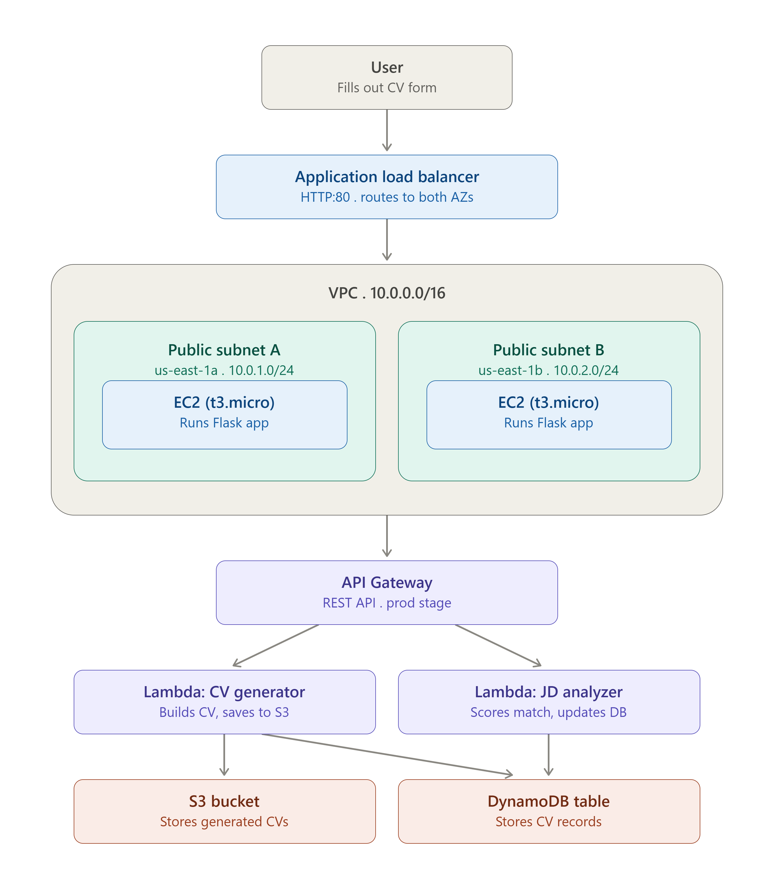

# 🎯 ATS CV Generator — Serverless AWS Project

> A cloud-native AWS application that generates ATS-friendly CVs and analyzes their compatibility with job descriptions using a multi-tier architecture across EC2, ALB, API Gateway, Lambda, S3, DynamoDB, IAM, and VPC.

## Table of Contents
- [Overview](#overview)
- [Architecture](#architecture)
- [Features](#features)
- [Live Test Result](#live-test-result)
- [Skills Demonstrated](#skills-demonstrated)
- [Real Issues Hit & Fixed](#real-issues-hit--fixed)
- [Possible Improvements](#possible-improvements)
- [Cost Management](#cost-management)
- [Repository Structure](#repository-structure)

## Overview

A production-style AWS architecture where multiple managed services work together: users submit their professional details through a web form, receive a downloadable ATS-friendly CV, and instantly check how well it matches a given job description.

Every component below — networking, compute, security groups, IAM permissions — was designed, deployed, and verified by hand on a personal AWS account. Full step-by-step build log with configuration details is in [`STEPS.md`](STEPS.md); design rationale for each decision is in [`CONCEPTS.md`](CONCEPTS.md).

## Architecture

- 1. User submits data through the Flask web application.
- 2. Traffic reaches the Application Load Balancer.
- 3. The ALB forwards the request to one of two EC2 instances.
- 4. The Flask application calls API Gateway.
- 5. API Gateway invokes the appropriate Lambda function.
- 6. Lambda stores generated CVs in S3 and CV records in DynamoDB.
- 7. The application returns the result to the user.

| Layer | Service | Purpose |
|---|---|---|
| Networking | VPC, Subnets, IGW, Route Table | Isolated network foundation across 2 Availability Zones |
| Compute | EC2 (x2, t3.micro) | Hosted the Flask frontend |
| Load Balancing | Application Load Balancer | Distributed traffic across both AZs |
| Serverless | Lambda (x2, Python 3.12) | CV generation + JD analysis logic |
| Storage | S3 | Stores generated CV files |
| Database | DynamoDB | Stores CV records (on-demand capacity) |
| API | API Gateway (REST) | Connects Flask → Lambda |
| Security | IAM Role (least privilege) | Lambda permissions scoped to exact resource ARNs |

Region: `us-east-1`

## Features

- **CV Generation** — fills out a form → generates an ATS-optimized text CV → stores it in S3 → returns a download link
- **JD Match Analysis** — pastes any job description → gets a match score, missing keywords, and improvement suggestions
- **High Availability** — two EC2 instances across two AZs behind a load balancer
- **Serverless Logic** — Lambda functions handle generation/analysis with zero server management
- **Least-Privilege Security** — IAM permissions scoped to the required actions and project resources, with wildcard usage limited to cases where AWS resource patterns require it
  
## Live Test Result

Successfully generated a CV, stored it in S3, and ran the JD analyzer end-to-end — returned a real match score with missing-keyword suggestions against an actual job description.

## Skills Demonstrated

- Designing a multi-AZ VPC from scratch (subnets, IGW, route tables)
- Security group chaining — restricting EC2 to accept traffic only from the ALB, not the internet directly
- Writing least-privilege IAM policies scoped to exact resource ARNs instead of wildcards
- Debugging real deployment failures (network-layer SSH issues, service crash-loops) using systemd logs and direct execution
- Making a cost-conscious architectural decision: decommissioning billable compute right after validation instead of leaving it running idle

## Real Issues Hit & Fixed

1. **EC2 instance type**: `t2.micro` isn't Free Tier–eligible on new AWS accounts (post-July 2025 Free Plan) — switched to `t3.micro`.
2. **SSH via EC2 Instance Connect kept failing**: allowing "My IP" in the security group wasn't enough — EC2 Instance Connect (browser-based) proxies the SSH session through AWS's own infrastructure, so the real source is AWS's `EC2_INSTANCE_CONNECT` service IP range, not the client's IP. Fixed by allowing `18.206.107.24/29` (the us-east-1 service range).
3. **Flask service crash-looping**: `systemctl status` only showed a generic `exit-code`. Ran the app directly (`python3 app.py`) to expose the real traceback and resolve it.

Full details with root-cause analysis in [`STEPS.md`](STEPS.md).

## Possible Improvements

This project intentionally trades some production-grade practices for learning breadth. If extended further, the next priorities would be:

- **Infrastructure as Code** — replace the manual console setup with Terraform for repeatable deployments
- **HTTPS** — add an ACM certificate and an HTTPS listener on the ALB
- **Private subnets** — move EC2 instances out of public subnets behind a NAT Gateway, so only the ALB is internet-facing
- **Auto Scaling Group** — replace the two fixed EC2 instances with a scaling group for true self-healing capacity

## Cost Management

EC2 instances and the Application Load Balancer were terminated immediately after validating the full flow, to avoid unnecessary charges on billable resources. Lambda, S3, DynamoDB, and API Gateway were left running since their idle cost is effectively zero.

## Repository Structure

    AWS-ATS-CV-Serverless-Project/
    ├── README.md
    ├── STEPS.md              # Full step-by-step build log
    ├── CONCEPTS.md           # Design rationale for each decision
    ├── screenshots/
    ├── code/
    │   ├── lambda_generator/lambda_function.py
    │   ├── lambda_analyzer/lambda_function.py
    │   └── flask_app/
    │       ├── app.py
    │       └── templates/index.html
    └── iam/ats-lambda-policy.json
