# 🛠️ Build Log — ATS CV Generator

A step-by-step record of every resource created, exactly as configured, plus every real issue hit along the way.

## 📋 Quick Navigation

| Step | Section |
|---|---|
| 1 | [🔑 Key Pair](#step-1--key-pair) |
| 2 | [🌐 VPC](#step-2--vpc) |
| 3 | [🧩 Subnets](#step-3--subnets) |
| 4 | [🚪 Internet Gateway](#step-4--internet-gateway) |
| 5 | [🗺️ Route Table](#step-5--route-table) |
| 6 | [🛡️ Security Groups](#step-6--security-groups) |
| 7 | [🖥️ EC2 Instances](#step-7--ec2-instances) |
| 8 | [⚖️ Target Group & Load Balancer](#step-8--target-group--load-balancer) |
| 9 | [🪣 S3 Bucket](#step-9--s3-bucket) |
| 10 | [🗃️ DynamoDB Table](#step-10--dynamodb-table) |
| 11 | [🔐 IAM Role & Policy](#step-11--iam-role--policy) |
| 12 | [⚡ Lambda: CV Generator](#step-12--lambda-cv-generator) |
| 13 | [⚡ Lambda: JD Analyzer](#step-13--lambda-jd-analyzer) |
| 14 | [🔌 API Gateway](#step-14--api-gateway) |
| 15 | [🚀 Flask Deployment](#step-15--flask-deployment) |
| 16 | [✅ End-to-End Test](#step-16--end-to-end-test) |

---

## Step 1 — 🔑 Key Pair

| Setting | Value |
|---|---|
| Name | `ats-keypair` |
| Type | RSA |
| Format | .pem |

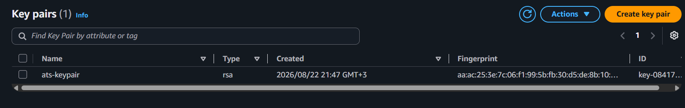

---

## Step 2 — 🌐 VPC

| Setting | Value |
|---|---|
| Name | `ats-cv-vpc` |
| IPv4 CIDR | `10.0.0.0/16` |

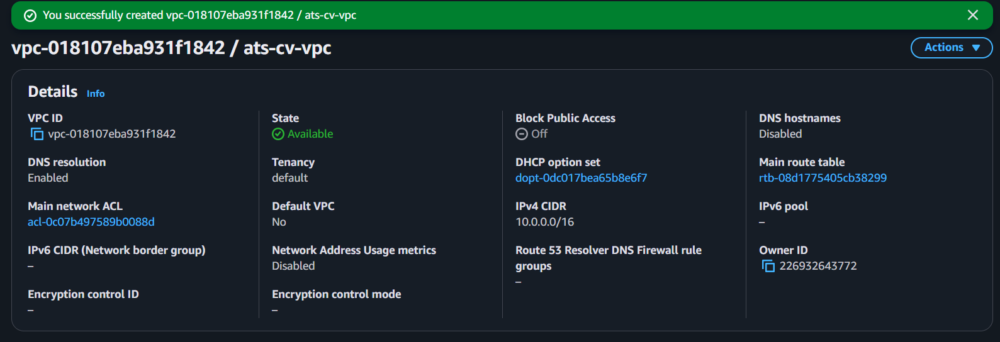

---

## Step 3 — 🧩 Subnets

| Name | AZ | CIDR | Auto-assign public IPv4 |
|---|---|---|---|
| `ats-public-subnet-1` | us-east-1a | 10.0.1.0/24 | ✅ |
| `ats-public-subnet-2` | us-east-1b | 10.0.2.0/24 | ✅ |

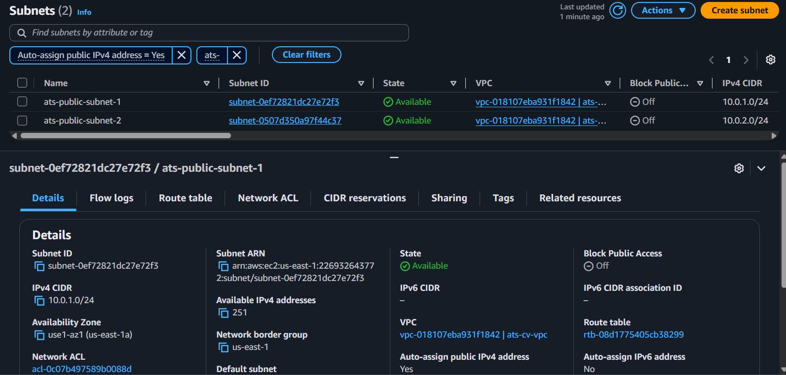

---

## Step 4 — 🚪 Internet Gateway

| Setting | Value |
|---|---|
| Name | `ats-igw` |
| Attached VPC | `ats-cv-vpc` |
| State | Attached |

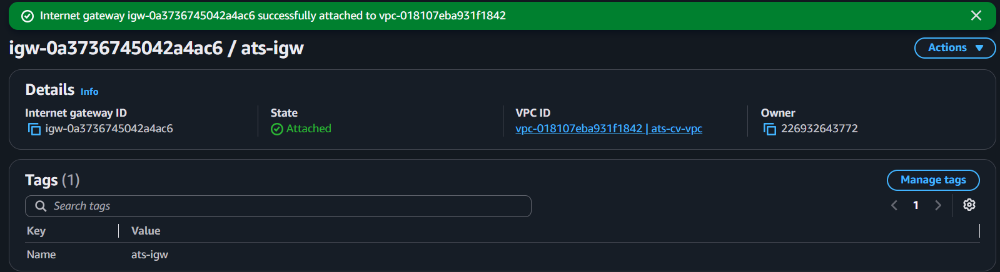

---

## Step 5 — 🗺️ Route Table

| Destination | Target |
|---|---|
| `10.0.0.0/16` | local |
| `0.0.0.0/0` | `ats-igw` |

Associated with both public subnets.

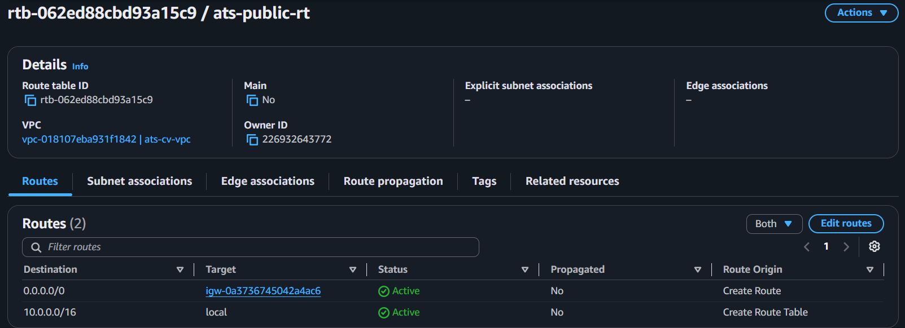
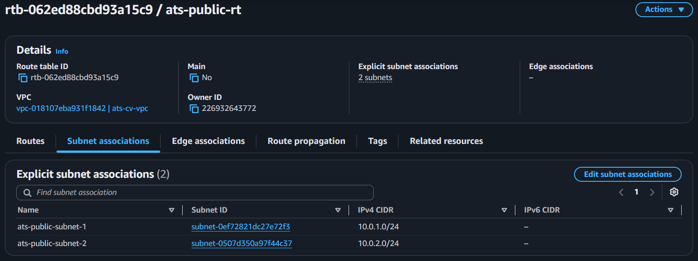

---

## Step 6 — 🛡️ Security Groups

**ALB security group** — `ats-alb-sg`

| Direction | Type | Port | Source |
|---|---|---|---|
| Inbound | HTTP | 80 | 0.0.0.0/0 |

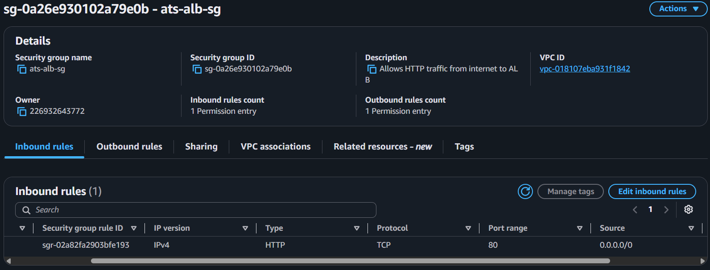

**EC2 security group** — `ats-ec2-sg`

| Direction | Type | Port | Source |
|---|---|---|---|
| Inbound | HTTP | 80 | `ats-alb-sg` |
| Inbound | SSH | 22 | Restricted — [see Step 15](#step-15--flask-deployment) |

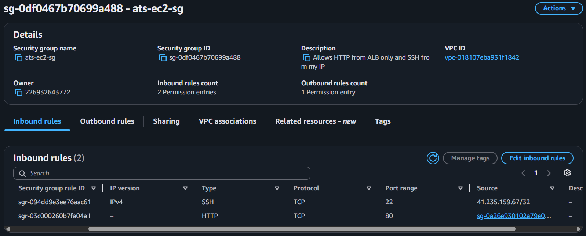

---

## Step 7 — 🖥️ EC2 Instances

| Setting | Instance 1 | Instance 2 |
|---|---|---|
| Name | ats-ec2-1 | ats-ec2-2 |
| Type | t3.micro | t3.micro |
| Subnet | ats-public-subnet-1 | ats-public-subnet-2 |
| Security group | ats-ec2-sg | ats-ec2-sg |
| Key pair | ats-keypair | ats-keypair |

User data (both instances):
```bash
#!/bin/bash
yum update -y
yum install -y python3 python3-pip
pip3 install flask requests
mkdir -p /home/ec2-user/ats-app/templates
```

> ⚠️ **Issue:** `t2.micro` is not Free Tier–eligible on new AWS accounts (post-July 2025 Free Plan). Used **t3.micro** instead.

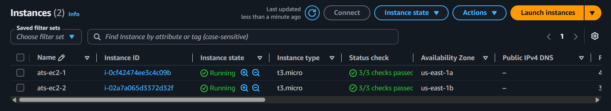

---

## Step 8 — ⚖️ Target Group & Load Balancer

| Setting | Value |
|---|---|
| Target group | `ats-target-group` — HTTP:80, health check `/health` |
| Load balancer | `ats-alb` — Internet-facing |
| Listener | HTTP:80 → `ats-target-group` |

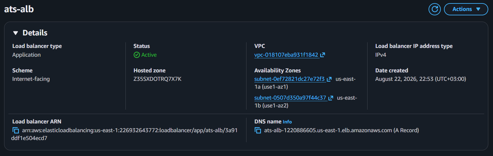

---

## Step 9 — 🪣 S3 Bucket

| Setting | Value |
|---|---|
| Name | `ats-cv-storage-<account-id>` |
| Region | us-east-1 |
| Public access | Blocked |

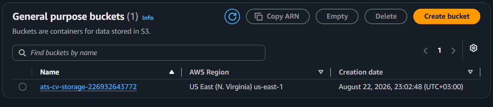

---

## Step 10 — 🗃️ DynamoDB Table

| Setting | Value |
|---|---|
| Name | `ats-cv-records` |
| Partition key | `cv_id` (String) |
| Capacity mode | On-demand |

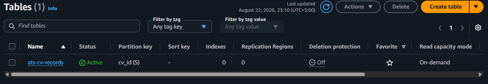
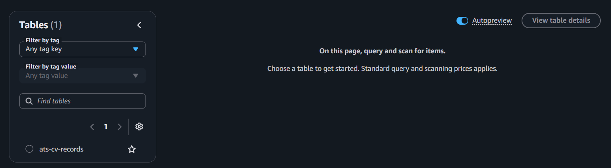

---

## Step 11 — 🔐 IAM Role & Policy

| Setting | Value |
|---|---|
| Policy | `ats-lambda-policy` |
| Role | `ats-lambda-role` |
| Principle | Least privilege — no wildcard resources |

```json
{
    "Version": "2012-10-17",
    "Statement": [
        {
            "Effect": "Allow",
            "Action": ["logs:CreateLogGroup", "logs:CreateLogStream", "logs:PutLogEvents"],
            "Resource": "*"
        },
        {
            "Effect": "Allow",
            "Action": ["s3:PutObject", "s3:GetObject"],
            "Resource": "arn:aws:s3:::ats-cv-storage-*/*"
        },
        {
            "Effect": "Allow",
            "Action": ["dynamodb:PutItem", "dynamodb:GetItem", "dynamodb:UpdateItem"],
            "Resource": "arn:aws:dynamodb:*:*:table/ats-cv-records"
        }
    ]
}
```

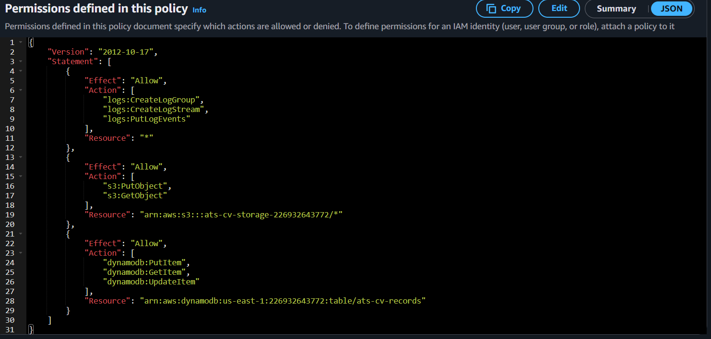
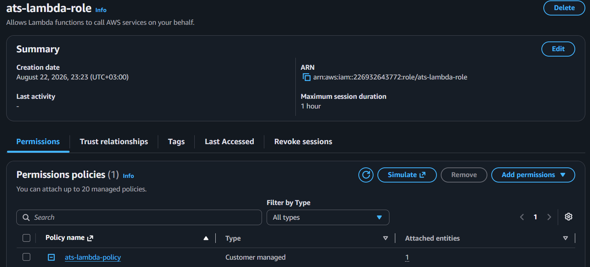

---

## Step 12 — ⚡ Lambda: CV Generator

| Setting | Value |
|---|---|
| Name | `ats-cv-generator` |
| Runtime | Python 3.12 |
| Role | `ats-lambda-role` |
| Env vars | `BUCKET_NAME`, `TABLE_NAME` |
| Timeout / Memory | 30s / 256MB |

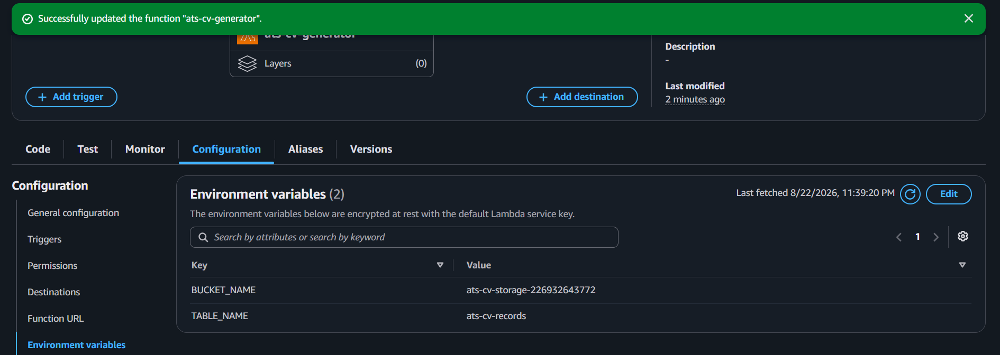

---

## Step 13 — ⚡ Lambda: JD Analyzer

| Setting | Value |
|---|---|
| Name | `ats-jd-analyzer` |
| Runtime | Python 3.12 |
| Role | `ats-lambda-role` |
| Env var | `TABLE_NAME` |

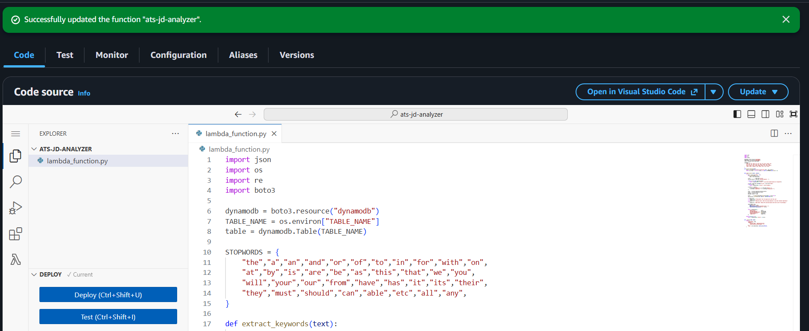
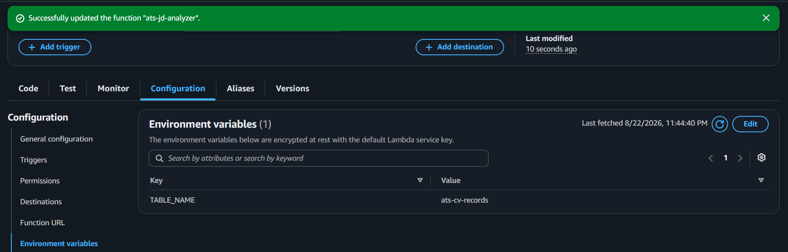

---

## Step 14 — 🔌 API Gateway

| Setting | Value |
|---|---|
| API name | `ats-cv-api` (REST, Regional) |
| Resources | `/generate` → `ats-cv-generator`, `/analyze` → `ats-jd-analyzer` |
| Integration | Lambda proxy + CORS enabled |
| Stage | `prod` |

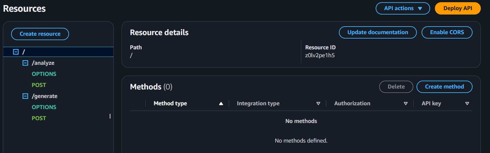
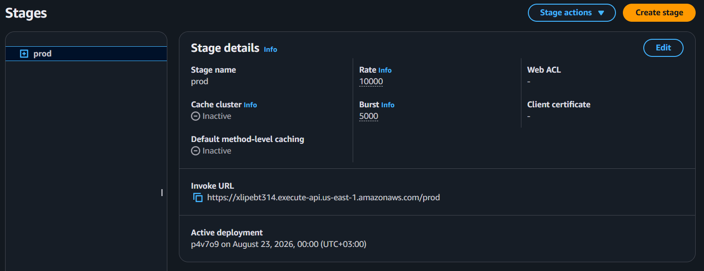

---

## Step 15 — 🚀 Flask Deployment

Deployed to both EC2 instances via EC2 Instance Connect, running as a `systemd` service pointing to the API Gateway Invoke URL.

### 🐛 Issues Hit & Fixed

| Issue | Root Cause | Fix |
|---|---|---|
| SSH connection failed via EC2 Instance Connect despite correct "My IP" | Browser-based connection is proxied through AWS's own infrastructure — real source IP is AWS's `EC2_INSTANCE_CONNECT` service range, not the client's | Allowed `18.206.107.24/29` (us-east-1 service range) in `ats-ec2-sg` |
| Flask systemd service crash-looping with generic `exit-code` | `systemctl status` doesn't show the actual Python traceback | Ran `python3 app.py` directly to expose and fix the real error |

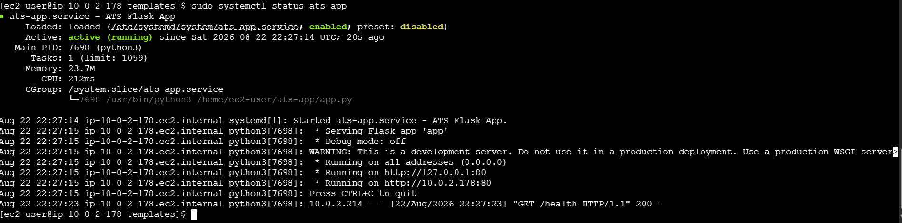

---

## Step 16 — ✅ End-to-End Test

1. Opened the ALB DNS name in the browser.
2. Filled in the form with sample details and generated a CV — got a success message with a download link.
3. Pasted a job description ("Cloud Security Operations") and checked the match score.

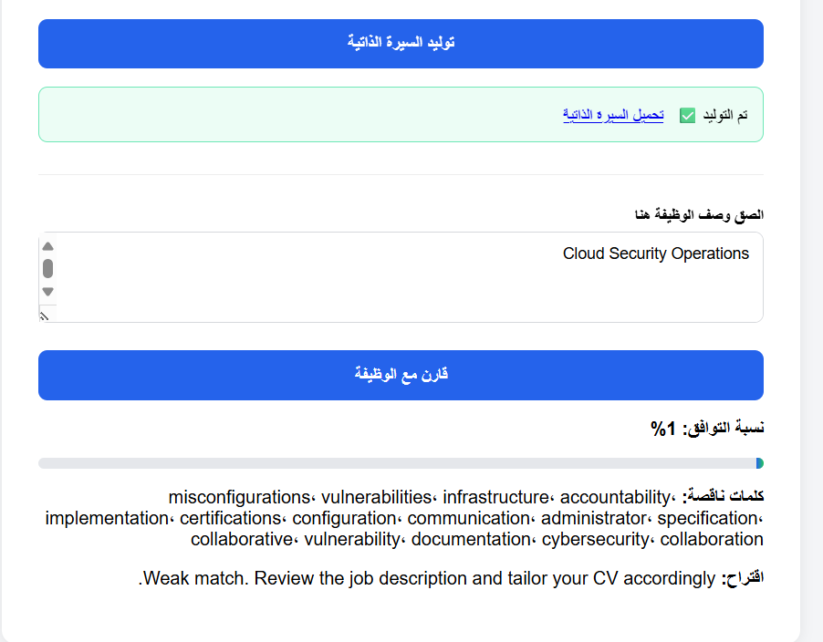
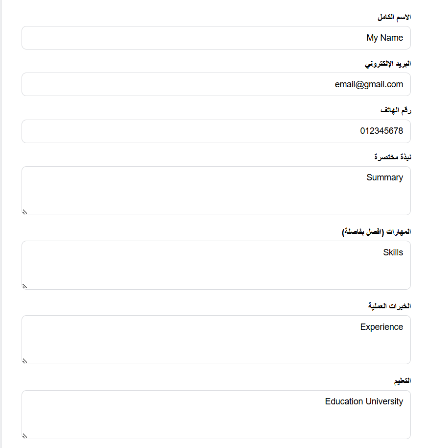

| Check | Result |
|---|---|
| Target group health | ✅ Healthy |
| ALB DNS reachable | ✅ |
| CV generation | ✅ Successful |
| JD match analysis | ✅ Returned score + missing keywords |

**🧹 Cleanup:** terminated both EC2 instances, deleted the ALB and target group immediately after testing to avoid ongoing charges. Lambda, S3, DynamoDB, and API Gateway left running (near-zero idle cost).

---

<div align="center">

**[⬆ Back to top](#-build-log--ats-cv-generator)**

</div>
